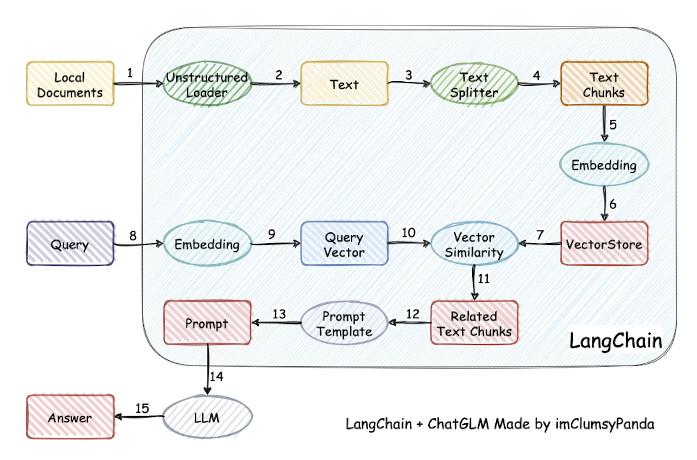

📃 **LangChain-Chatchat** (原 Langchain-ChatGLM)


## 介绍

🤖️ 一种利用 [langchain](https://github.com/langchain-ai/langchain)
思想实现的基于本地知识库的问答应用，目标期望建立一套对中文场景与开源模型支持友好、可离线运行的知识库问答解决方案。

💡 受 [GanymedeNil](https://github.com/GanymedeNil) 的项目 [document.ai](https://github.com/GanymedeNil/document.ai)
和 [AlexZhangji](https://github.com/AlexZhangji)
创建的 [ChatGLM-6B Pull Request](https://github.com/THUDM/ChatGLM-6B/pull/216)
启发，建立了全流程可使用开源模型实现的本地知识库问答应用。本项目的最新版本中通过使用 [FastChat](https://github.com/lm-sys/FastChat)
接入 Vicuna, Alpaca, LLaMA, Koala, RWKV 等模型，依托于 [langchain](https://github.com/langchain-ai/langchain)
框架支持通过基于 [FastAPI](https://github.com/tiangolo/fastapi) 提供的 API
调用服务，或使用基于 [Streamlit](https://github.com/streamlit/streamlit) 的 WebUI 进行操作。

✅ 依托于本项目支持的开源 LLM 与 Embedding 模型，本项目可实现全部使用**开源**模型**离线私有部署**。与此同时，本项目也支持
OpenAI GPT API 的调用，并将在后续持续扩充对各类模型及模型 API 的接入。

⛓️ 本项目实现原理如下图所示，过程包括加载文件 -> 读取文本 -> 文本分割 -> 文本向量化 -> 问句向量化 ->
在文本向量中匹配出与问句向量最相似的 `top k`个 -> 匹配出的文本作为上下文和问题一起添加到 `prompt`中 -> 提交给 `LLM`生成回答。

📺 [原理介绍视频](https://www.bilibili.com/video/BV13M4y1e7cN/?share_source=copy_web&vd_source=e6c5aafe684f30fbe41925d61ca6d514)



从文档处理角度来看，实现流程如下：


🚩 本项目未涉及微调、训练过程，但可利用微调或训练对本项目效果进行优化。

🌐 [AutoDL 镜像](https://www.codewithgpu.com/i/chatchat-space/Langchain-Chatchat/Langchain-Chatchat) 中 `0.2.10`

版本所使用代码已更新至本项目 `v0.2.10` 版本。

🐳 [Docker 镜像](isafetech/chatchat:0.2.10) 已经更新到 ```0.2.10``` 版本。


## ===============================以上是原项目====[原项目地址](https://github.com/chatchat-space/Langchain-Chatchat)========================


# 主要变动
1. 添加了.env文件，方便配置
2. 修改了./config/model_config.py.example 读取env
3. 修改了./config/server_config.py.example 读取env
3. 修改了./startup.py 自动加载


****

# 启动方法 国内源

```shell
#首先
#初始化配置
#安装conda
#切换环境
#安装python3.11
#升级pip pip install --upgrade pip

$ chmod +x init_for_ali_api.sh
$ bash ./init_for_ali_api.sh
```

```shell
#第二步
在.env里配置ali_api_key  阿里云的 api-key
```
```shell
#第三步
#启动服务
$ HF_ENDPOINT="https://hf-mirror.com" python startup.py -a
```
